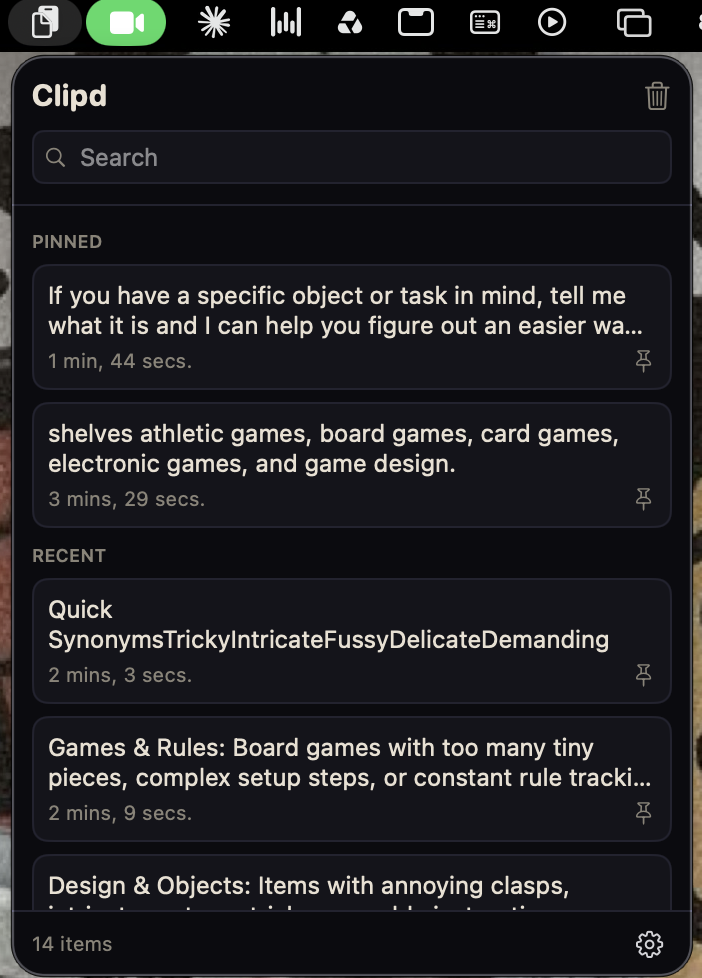
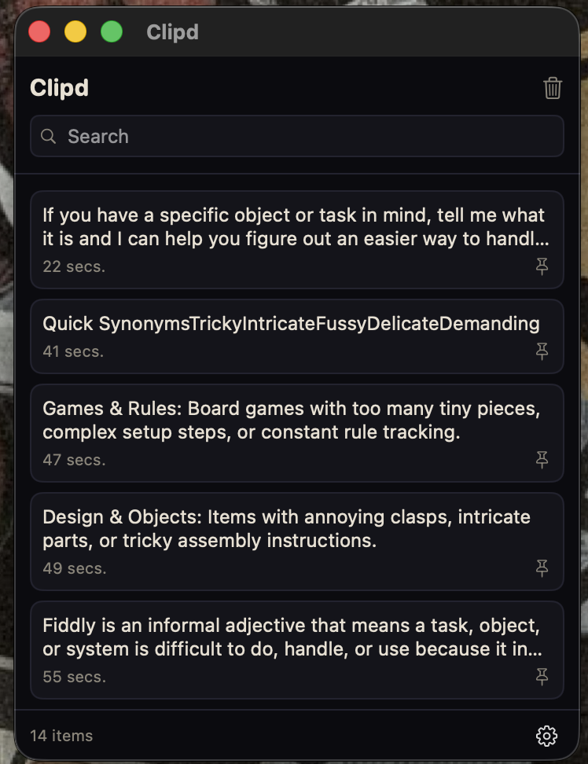

# Clipd


A lightweight, local-only clipboard history manager for macOS. Swift + SwiftUI,
no third-party dependencies, MIT licensed.

| Menu bar | Dock window |
| :---: | :---: |
|  |  |

## Features

- Keeps your last 30 copied text snippets (pinned items don't count against the cap)
- Click an item to copy it back to the clipboard
- Search, pin favorites, clear history (pinned items survive unless you say otherwise)
- Pause recording any time
- Midnight-black dark theme and beige light theme, or follow the system
- Lives in the menu bar and the Dock — or menu-bar-only via a toggle in settings

## Your data stays on your Mac

- **No networking code at all.** No `URLSession`, no analytics, no update checks.
- **No scary permissions.** Clipd never asks for Accessibility, Full Disk Access,
  or Screen Recording. Clicking an item copies it — you paste yourself with ⌘V.
- **Password managers are respected.** Payloads marked with the standard
  [nspasteboard.org](http://nspasteboard.org) concealed/transient/auto-generated
  types are never recorded. There's also a Pause toggle for manual credential handling.
- **One small file.** History lives in
  `~/Library/Application Support/Clipd/history.json` with owner-only (`0600`)
  permissions, capped at 30 unpinned items. Delete the file and it's gone.
- **Not encrypted at rest.** FileVault is the real protection here. Note that
  `~/Library/Application Support/` is included in Time Machine and most cloud
  backups, so a copied secret can outlive the 30-item cap inside a backup.
- **No third-party dependencies** — no supply-chain surface.

## Install (no building required)

> **Apple Silicon only.** Clipd runs on M-series Macs (M1 and later) with
> macOS 14+. Intel Macs are not supported.

1. Download `Clipd.app.zip` from the latest
   [GitHub Release](https://github.com/net-folade/clipd/releases/latest)
   and unzip it.
2. Drag `Clipd.app` into `/Applications`.
3. First launch only: macOS quarantines apps downloaded from the internet, and
   Clipd isn't notarized. Either right-click `Clipd.app` → **Open** → **Open**,
   or clear the quarantine flag in Terminal:

   ```sh
   xattr -d com.apple.quarantine /Applications/Clipd.app
   ```

After that it opens normally. Prefer to see exactly what you're running?
Build from source below — it's two commands.

## Build from source

Requires macOS 14+ and either Xcode or just the Command Line Tools
(`xcode-select --install`).

```sh
git clone https://github.com/net-folade/clipd.git
cd clipd
swift Scripts/make-icon.swift   # once — renders Assets/AppIcon.icns
Scripts/build-app.sh            # release build → Clipd.app (ad-hoc signed)
cp -R Clipd.app /Applications
```

Run the tests with `Scripts/test.sh` (a thin wrapper over `swift test` that adds
the framework search paths a CLT-only toolchain needs for Swift Testing).

### Gatekeeper note

Clipd is ad-hoc signed, not notarized (notarization requires a paid Apple
Developer account and isn't needed for personal use). On first launch,
right-click `Clipd.app` → **Open** → **Open** to get past Gatekeeper.

## Out of scope for v1

Images/files, global hotkey, auto-paste, launch-at-login, sync, encryption at
rest, configurable history size.

## License

[MIT](LICENSE) © Folade
